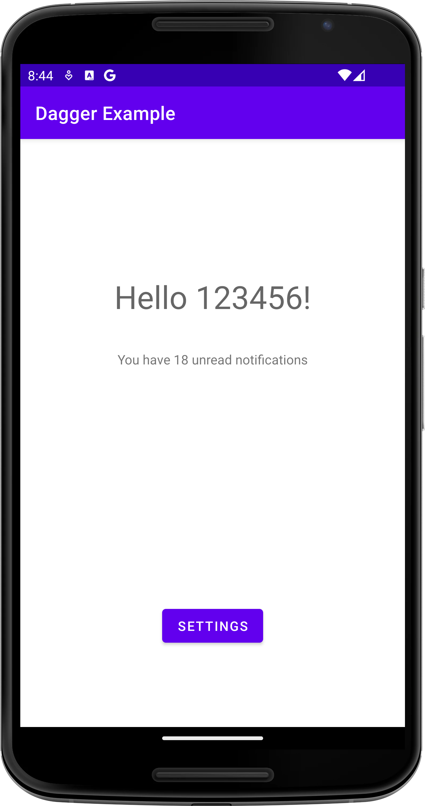

# Dagger Example

## Project Description

The Dagger Example project is a sample Android application demonstrating the correct usage of the
Dagger library (not Hilt) with Kotlin. It includes examples of using Mockito and JUnit tests,
making it a valuable resource for understanding how to implement dependency injection and testing
in Android applications. The app features a few screens, such as registration, terms of use, a
"hello" screen, and a settings screen. This project fully follows the code lab from Android Dagger
Code Lab with minor changes.

## Features

- **Dependency Injection**: Demonstrates the correct usage of Dagger for dependency injection in
  Android.
- **Testing**: Includes examples of using Mockito and JUnit tests.
- **Sample Screens**: Registration, terms of use, "hello" screen, and settings screen.

## Installation Instructions

1. Download the project.
2. Open the project in Android Studio.
3. Run the project on an Android emulator or physical Android device.

## Usage

The primary purpose of this application is educational, serving as a correct sample of
implementing Dagger with Kotlin and tests for it. The tests cover various examples of general
implementation tests for any Kotlin Android application.

## Technologies Used

- [Kotlin](https://kotlinlang.org/): Programming language.
- [Android](https://developer.android.com/studio/intro): Mobile operating system.
- **Monolith View Model Architecture**:
  [Monolith](https://en.wikipedia.org/wiki/Monolithic_architecture).
- **Libraries**:
    - `androidx.lifecycle:lifecycle-livedata-ktx`
    - `com.google.dagger:dagger`
    - `junit:junit`
    - `org.mockito:mockito-core`
    - `android.arch.core:core-testing`
    - `androidx.test.espresso:espresso-core`
    - `androidx.test:runner`
    - `SharedPreferencesStorage`
- **Code Readability:** code is easily readable with no unnecessary blank lines, no unused variables
  or methods, and no commented-out code, all variables, methods, and resource IDs are descriptively
  named such that another developer reading the code can easily understand their function.

## Contributing

Anyone can contribute by creating a pull request with changes. Contributions are welcome, although
the app is primarily for educational purposes.

## Credits

This project fully follows the
[Using Dagger in your Android app - Kotlin](https://developer.android.com/codelabs/android-dagger)
with minor changes.

## License

This project does not have an intentional license.

• Screenshots:
<!--suppress CheckImageSize -->

## Contact:

For any inquiries or suggestions, please open an issue on the GitHub repository
or reach out to me directly at
[dmytro@turskyi.com](mailto:dmytro@turskyi.com).
